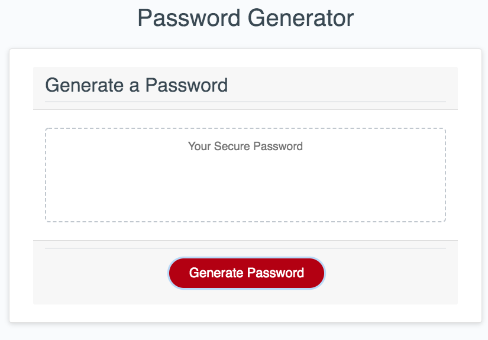

# Javascript: Password Generator

Click the button:

Select some criteria:

And voilà!

You can see the deployed app [here](https://maphaiyarath.github.io/password-generator/).

## Table of Contents
* [Description](#description)
* [Installation](#installation)
* [Usage](#usage)
* [Credits](#credits)
* [License](#license)
* [Badges](#badges)

## Description
This application allows you to generate a random password based on selected criteria, such as length, lowercase, uppercase, numeric, and/or special characters. Stronger passwords provide greater security. Simply click the button to generate a secure password!

Further development could include having an icon that would allow you to copy to your clipboard. Also, you are not guaranteed to have all of the criteria you select for your password.

## Installation
n/a

## Usage
n/a

## Credits
n/a

## License
This project is licensed under the MIT license.

## Badges
